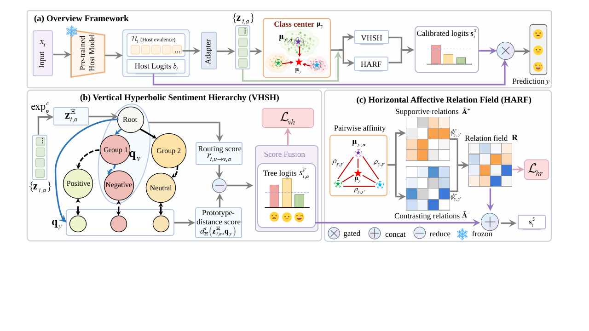

# VMH-P: Vertical-Meets-Horizontal Prediction

This repository contains the anonymous code artifact for **VMH-P**
(Vertical-Meets-Horizontal Prediction), a post-hoc plug-and-play structured
prediction module for multimodal sentiment analysis.

VMH-P keeps the host model frozen. It consumes cached host logits and evidence
features, induces a vertical hyperbolic sentiment hierarchy and a horizontal
affective relation field from host-derived class geometry, and refines
predictions through a lightweight residual structured head.

<p align="center">
  
</p>

## Repository Layout

```text
vmhp/
  core/          Evidence packets, feature adapters, VHSH, HARF, VMHP head, loss.
  topology/      Class-center estimation, hierarchy induction, relation init.
  adapters/      Thin adapters for frozen host models or cached features.
  tools/         Warmup, structure induction, training, evaluation, ablations.

configs/         Example VMH-P hyperparameter configuration.
tests/           Unit tests for geometry, relation field, routing, and detach checks.
vis/             Plotting scripts and selected paper figures.
vmhp_runs/       Lightweight result summaries and figure artifacts.
assets/          Paper figures used by this README.
```

The public artifact intentionally does not redistribute full CLMLF, D2R, or
SPP-SCL source trees, raw MVSA/TumEmo data, pretrained checkpoints, or large
cached feature tensors. Those assets should be obtained from the original
providers and kept outside this lightweight code repository.

## Method Summary

VMH-P follows three steps:

1. Train or load a multimodal sentiment host model and freeze it.
2. Export frozen host logits and evidence features into cached `.pt` files.
3. Train VMH-P on the cached tensors only.

The VMH-P head contains:

- **VHSH**: a vertical hyperbolic sentiment hierarchy over latent affective
  regions and fine-grained classes.
- **HARF**: a horizontal affective relation field with supportive and
  contrasting class interactions, initialized from class geometry and refined
  during structured-head training.
- **Confidence-gated residual prediction**: a lightweight residual correction
  added to the frozen host logits.

Backbone parameters are not updated during VMH-P optimization.

## Supported Backbones

The paper evaluates VMH-P with three frozen image-text sentiment backbones.
Their full implementations are external dependencies.

| Backbone | Paper | Code |
|---|---|---|
| CLMLF | [CLMLF: A Contrastive Learning and Multi-Layer Fusion Method for Multimodal Sentiment Detection](https://aclanthology.org/2022.findings-naacl.175/) | [Link-Li/CLMLF](https://github.com/Link-Li/CLMLF) |
| D2R | [D2R: Dual-Branch Dynamic Routing Network for Multimodal Sentiment Detection](https://aclanthology.org/2024.emnlp-main.207/) | [SorF520/D2R](https://github.com/SorF520/D2R) |
| SPP-SCL | [SPP-SCL: Semi-Push-Pull Supervised Contrastive Learning for Image-Text Sentiment Analysis and Beyond](https://ojs.aaai.org/index.php/AAAI/article/view/37200) | [TomorrowJW/SPP-SCL](https://github.com/TomorrowJW/SPP-SCL) |

## Datasets

| Dataset | Labels | Link | Citation |
|---|---:|---|---|
| MVSA-Single | 3 | [MCRLab MVSA page](https://mcrlab.net/research/mvsa-sentiment-analysis-on-multi-view-social-data/) | Niu et al., MMM 2016 |
| MVSA-Multiple | 3 | [MCRLab MVSA page](https://mcrlab.net/research/mvsa-sentiment-analysis-on-multi-view-social-data/) | Niu et al., MMM 2016 |
| TumEmo | 7 | [TumEmo/MVAN repository](https://github.com/YangXiaocui1215/MVAN) | Yang et al., IEEE TMM 2021 |

Please follow the licenses and usage terms of the original dataset providers.

## Installation

```bash
conda create -n vmhp python=3.11 -y
conda activate vmhp

pip install -r requirements.txt
```

If CUDA is used, install the PyTorch build that matches the local CUDA driver
before installing the remaining dependencies.

## Cached Feature Format

Each split is stored as a `.pt` dictionary. Required keys:

```python
{
    "base_logits": FloatTensor[N, C],
    "labels": LongTensor[N],
}
```

At least one evidence source must also be present:

```python
{
    "text": FloatTensor[N, D_text],
    "vision": FloatTensor[N, D_vision],
    "multimodal": FloatTensor[N, D_mm],
    "routed_text": FloatTensor[N, D_rt],
    "routed_vision": FloatTensor[N, D_rv],
}
```

Only the source tensors available for a host need to be exported. The loader
also accepts `image -> vision`, `mm -> multimodal`, and `label -> labels`.

## Basic Workflow

Assume the frozen host has exported cached features:

```text
data_cache/<host>/<dataset>/train_features.pt
data_cache/<host>/<dataset>/val_features.pt
data_cache/<host>/<dataset>/test_features.pt
```

Warm up the evidence adapters:

```bash
python -m vmhp.tools.warmup_adapters \
  --train-features data_cache/clmlf/mvsa_single/train_features.pt \
  --val-features data_cache/clmlf/mvsa_single/val_features.pt \
  --lambda-adp 0.10 \
  --output runs/clmlf_mvsa_single/ufa_warmup.pt
```

Induce the VMH-P structure:

```bash
python -m vmhp.tools.init_structure \
  --train-features data_cache/clmlf/mvsa_single/train_features.pt \
  --ufa-warmup runs/clmlf_mvsa_single/ufa_warmup.pt \
  --num-internal 2 \
  --tree-induction relation_aware \
  --output-dir runs/clmlf_mvsa_single/structure
```

Train VMH-P:

```bash
python -m vmhp.tools.train_vmhp \
  --train-features data_cache/clmlf/mvsa_single/train_features.pt \
  --val-features data_cache/clmlf/mvsa_single/val_features.pt \
  --test-features data_cache/clmlf/mvsa_single/test_features.pt \
  --ufa-warmup runs/clmlf_mvsa_single/ufa_warmup.pt \
  --structure runs/clmlf_mvsa_single/structure/structure.pt \
  --output-dir runs/clmlf_mvsa_single/vmhp \
  --epochs 6 \
  --patience 2 \
  --batch-size 2048 \
  --structured-lr 3e-4 \
  --lambda-str 0.10 \
  --lambda-vh 0.10 \
  --lambda-hr 0.01
```

When a warmup checkpoint is provided, evidence adapters are fixed during VMH-P
training. `--train-adapters` can be used for diagnostic fine-tuning variants.

Optionally apply the same post-hoc switch-selector protocol used for the main
table:

```bash
python -m vmhp.tools.train_switch_selector \
  --checkpoint runs/clmlf_mvsa_single/vmhp/best_vmhp.pt \
  --structure runs/clmlf_mvsa_single/structure/structure.pt \
  --train-features data_cache/clmlf/mvsa_single/train_features.pt \
  --dev-features data_cache/clmlf/mvsa_single/val_features.pt \
  --test-features data_cache/clmlf/mvsa_single/test_features.pt \
  --start-logits final \
  --alt-logits base,tree,structured,final \
  --selection-split dev \
  --rank-by sum \
  --output runs/clmlf_mvsa_single/selector.json
```

On shared machines, restrict CPU threads and use a lower process priority:

```bash
OMP_NUM_THREADS=1 MKL_NUM_THREADS=1 OPENBLAS_NUM_THREADS=1 NUMEXPR_NUM_THREADS=1 \
nice -n 10 python -m vmhp.tools.train_vmhp ...
```

## Default Hyperparameters

The default implementation settings follow the paper:

| Group | Hyperparameters |
|---|---|
| Structure | `d=64`, `K=2` for MVSA and `K=3` for TumEmo, `c=0.25`, `beta=0.30`, `tau_r=0.07` |
| Horizontal field | `eta=0.50`, `lambda_-=1.0`, `lambda_hr=0.01` |
| Source/residual | `lambda_adp=0.10`, `tau_e=0.10`, `tau_s=0.10`, `tau_g=0.10`, residual scale initialized to `0` |
| Loss | `lambda_str=0.10`, `lambda_vh=0.10`, `lambda_hr=0.01` |
| Optimization | AdamW, adapter warmup LR `1e-4`, structured-head LR `3e-4`, weight decay `1e-4`, batch size `2048`, max epochs `6`, patience `2`, seed `42` |

The editable defaults are in `configs/base.yaml`.

## Main Results

Values are ACC/F1 (%). Parentheses in the paper table report absolute gains
over the frozen host.

| Host | MVSA-Single Host | MVSA-Single + VMH-P | MVSA-Multiple Host | MVSA-Multiple + VMH-P | TumEmo Host | TumEmo + VMH-P |
|---|---:|---:|---:|---:|---:|---:|
| CLMLF | 75.33 / 73.46 | 78.22 / 77.39 | 72.00 / 69.83 | 75.53 / 73.57 | 68.10 / 68.00 | 73.35 / 73.32 |
| D2R | 76.67 / 75.59 | 78.00 / 77.94 | 71.59 / 70.85 | 76.12 / 74.26 | 74.64 / 74.60 | 77.39 / 77.41 |
| SPP-SCL | 81.33 / 80.15 | 89.56 / 89.04 | 78.71 / 77.53 | 83.35 / 82.66 | 72.15 / 72.13 | 73.59 / 73.67 |

Lightweight result summaries and selected figure outputs are placed in
`vmhp_runs/`. Large checkpoints and cached features should remain outside the
public repository.

## Optional Local Checkpoint Bundle

For local reproduction on the authors' machine, checkpoints and cached host
representations can be placed under `artifacts/checkpoints/`. This directory is
ignored by Git and is not part of the anonymous public artifact.

The local bundle follows this layout when reproducing only the current main
table:

```text
artifacts/checkpoints/
  main_table_seed42/
    SOURCE_MAP.md
    clmlf/{mvsa_single,mvsa_multiple,tumemo}/{backbone,cache,vmhp}/
    d2r/{mvsa_single,mvsa_multiple,tumemo}/{backbone,cache,vmhp}/
    spp_scl/{mvsa_single,mvsa_multiple,tumemo}/{backbone,cache,vmhp}/
```

Do not add this directory to a public GitHub commit unless the corresponding
third-party licenses and file-size limits are handled separately.

## Tests

```bash
python -m pytest -q tests
```

The tests cover Lorentz geometry, vertical routing, horizontal relation-field
constraints, D2R adapter semantics, and the frozen-host detach contract.

## Release Notes

For anonymous review, keep this repository focused on the VMH-P method code,
configuration files, plotting scripts, selected result summaries, and paper
figures. Do not commit raw data, full third-party backbone repositories,
pretrained checkpoints, or large cached tensors.

## Acknowledgements and Citations

This artifact builds on public multimodal sentiment and emotion benchmarks and
uses external backbone implementations. Please cite the original works when
using their code or data.

```bibtex
@inproceedings{li2022clmlf,
  author = {Zhen Li and Bing Xu and Conghui Zhu and Tiejun Zhao},
  title = {{CLMLF}: A Contrastive Learning and Multi-Layer Fusion Method for Multimodal Sentiment Detection},
  booktitle = {Findings of the Association for Computational Linguistics: NAACL 2022},
  pages = {2282--2294},
  publisher = {Association for Computational Linguistics},
  year = {2022},
  doi = {10.18653/v1/2022.findings-naacl.175},
  url = {https://aclanthology.org/2022.findings-naacl.175/}
}

@inproceedings{chen2024d2r,
  author = {Yifan Chen and Kuntao Li and Weixing Mai and Qiaofeng Wu and Yun Xue and Fenghuan Li},
  title = {{D2R}: Dual-Branch Dynamic Routing Network for Multimodal Sentiment Detection},
  booktitle = {Proceedings of the 2024 Conference on Empirical Methods in Natural Language Processing},
  pages = {3536--3547},
  publisher = {Association for Computational Linguistics},
  year = {2024},
  doi = {10.18653/v1/2024.emnlp-main.207},
  url = {https://aclanthology.org/2024.emnlp-main.207/}
}

@inproceedings{wu2026sppscl,
  author = {Jiesheng Wu and Shengrong Li},
  title = {{SPP-SCL}: Semi-Push-Pull Supervised Contrastive Learning for Image-Text Sentiment Analysis and Beyond},
  booktitle = {Proceedings of the AAAI Conference on Artificial Intelligence},
  year = {2026},
  doi = {10.1609/aaai.v40i3.37200},
  url = {https://ojs.aaai.org/index.php/AAAI/article/view/37200}
}

@inproceedings{niu2016mvsa,
  author = {Teng Niu and Shuhui Zhu and Liangliang Pang and Abdulmotaleb El Saddik},
  title = {Sentiment Analysis on Multi-View Social Data},
  booktitle = {MultiMedia Modeling},
  pages = {15--27},
  publisher = {Springer},
  year = {2016},
  doi = {10.1007/978-3-319-27674-8_2}
}

@article{yang2021tumemo,
  author = {Xiaocui Yang and Shi Feng and Daling Wang and Yifei Zhang},
  title = {Image-Text Multimodal Emotion Classification via Multi-View Attentional Network},
  journal = {IEEE Transactions on Multimedia},
  volume = {23},
  pages = {4014--4026},
  year = {2021},
  doi = {10.1109/TMM.2020.3035277},
  url = {https://doi.org/10.1109/TMM.2020.3035277}
}
```
