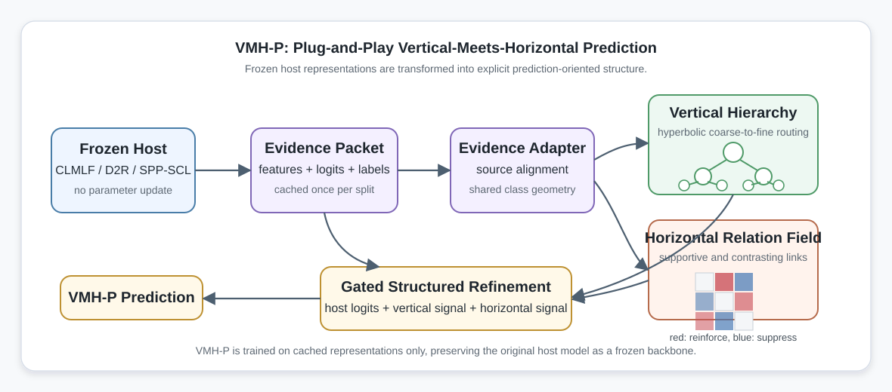

# VMH-P: Vertical-Meets-Horizontal Prediction

This repository contains the anonymous artifact for **VMH-P**, a post-hoc
plug-and-play structured prediction module for multimodal sentiment analysis.
VMH-P does not modify the frozen host model. Instead, it operates on cached
host representations and logits, induces explicit vertical and horizontal class
structures from host-derived class geometry, and refines the final prediction
with a lightweight structured head.

The implementation directory is currently named `TreeRing-Plugin/` for
backward compatibility with the experiment scripts. In the paper, this code
corresponds to VMH-P.

<p align="center">
  
</p>

## What Is Included

The public artifact is intended to expose the VMH-P method while avoiding the
release of full third-party backbone implementations and large raw datasets.

```text
TreeRing-Plugin/
  core/          VMH-P modules: feature adapters, hyperbolic tree,
                 relation field, source fusion, conflict gate, losses.
  topology/      Class-center estimation, hierarchy induction, and relation
                 initialization.
  adapters/      Lightweight host adapters for cached evidence packets.
  tools/         Structure initialization, training, evaluation, ablation,
                 multi-seed, sensitivity, and visualization utilities.
  configs/       Example configuration files.
  tests/         Unit tests for geometry, routing, relation, and detach checks.
  train_plugin.py

vis/
  Plotting scripts and paper-ready figures.

setp_iclr_runs/
  Selected result summaries, tables, and visualization outputs used by the
  paper. Large checkpoints and cached features should be kept outside the
  public repository.
```

## What Is Not Included

The anonymous release should not redistribute:

- full source trees of CLMLF, D2R, or SPP-SCL;
- raw MVSA-Single, MVSA-Multiple, or TumEmo images/text files;
- pretrained language/vision checkpoints such as `bert-base-uncased`;
- large experiment checkpoints, cached feature tensors, logs, or temporary run
  directories;
- files under `__pycache__/`, `.pytest_cache/`, `checkpoint/`, `save_models/`,
  `logs/`, or `run_logs/`.

Instead, VMH-P only requires frozen host outputs exported into the unified
cached-feature format described below.

## Method Overview

VMH-P consists of three stages.

1. **Post-hoc feature caching.** A trained multimodal host model is frozen and
   used to export its original logits and intermediate evidence features.
2. **Structure induction.** Class centers are computed from the cached evidence
   space. VMH-P induces a vertical hierarchy over latent affective regions and
   initializes a horizontal relation field over sentiment classes.
3. **Structured prediction refinement.** A lightweight VMH-P head is trained on
   cached features only. The original host parameters remain detached and are
   never updated.

The vertical branch models coarse-to-fine decision structure with a hyperbolic
tree. The horizontal branch models supportive and contrasting inter-class
relations. The final prediction combines the frozen host logits with the
structured prediction signal through gated residual refinement.

## Supported Backbones

VMH-P is designed as a host-agnostic post-hoc module. The experiments in the
paper use three frozen image-text sentiment backbones:

| Backbone | Paper | Code |
|---|---|---|
| CLMLF | [CLMLF: A Contrastive Learning and Multi-Layer Fusion Method for Multimodal Sentiment Detection](https://aclanthology.org/2022.findings-naacl.175/) | [Link-Li/CLMLF](https://github.com/Link-Li/CLMLF) |
| D2R | [D2R: Dual-Branch Dynamic Routing Network for Multimodal Sentiment Detection](https://aclanthology.org/2024.emnlp-main.207/) | [SorF520/D2R](https://github.com/SorF520/D2R) |
| SPP-SCL | [SPP-SCL: Semi-Push-Pull Supervised Contrastive Learning for Image-Text Sentiment Analysis and Beyond](https://ojs.aaai.org/index.php/AAAI/article/view/37200) | [TomorrowJW/SPP-SCL](https://github.com/TomorrowJW/SPP-SCL) |

The full backbone source trees are not redistributed in this repository. To use
another backbone, export its frozen logits and evidence features into the
cached-feature format below and implement a thin adapter if necessary.

## Datasets

The paper evaluates VMH-P on three public image-text sentiment or emotion
datasets:

| Dataset | Labels | Link | Citation |
|---|---:|---|---|
| MVSA-Single | 3 sentiment classes | [MCRLab MVSA page](https://mcrlab.net/research/mvsa-sentiment-analysis-on-multi-view-social-data/) | Niu et al., MMM 2016 |
| MVSA-Multiple | 3 sentiment classes | [MCRLab MVSA page](https://mcrlab.net/research/mvsa-sentiment-analysis-on-multi-view-social-data/) | Niu et al., MMM 2016 |
| TumEmo | 7 emotion classes | [TumEmo/MVAN repository](https://github.com/YangXiaocui1215/MVAN), [paper](https://ieeexplore.ieee.org/document/9246699) | Yang et al., IEEE TMM 2021 |

Please follow the licenses and access terms of the original dataset providers.
This repository does not redistribute raw images or raw text files.

## Installation

The code is written in Python and PyTorch. A minimal environment can be created
as follows:

```bash
conda create -n vmhp python=3.11 -y
conda activate vmhp

pip install torch numpy scipy scikit-learn pandas matplotlib seaborn pyyaml tqdm pytest
```

If CUDA is required, install the PyTorch build that matches the local CUDA
driver before installing the remaining packages.

## Cached Feature Format

Each split is stored as a `.pt` file containing a Python dictionary. Required
keys are:

```python
{
    "base_logits": FloatTensor[N, C],
    "labels": LongTensor[N],
}
```

At least one evidence source must also be present:

```python
{
    "text": FloatTensor[N, D_text],          # optional
    "vision": FloatTensor[N, D_vision],      # optional
    "multimodal": FloatTensor[N, D_mm],      # optional
    "routed_text": FloatTensor[N, D_rt],     # optional
    "routed_vision": FloatTensor[N, D_rv],   # optional
}
```

Aliases `image -> vision`, `mm -> multimodal`, and `label -> labels` are handled
by the loader. Host-specific code only needs to export these tensors; the VMH-P
core is backbone-agnostic.

## Basic Workflow

Assume the frozen host has exported:

```text
data_cache/<host>/<dataset>/train_features.pt
data_cache/<host>/<dataset>/val_features.pt
data_cache/<host>/<dataset>/test_features.pt
```

Warm up the unified feature adapters:

```bash
python TreeRing-Plugin/tools/warmup_adapters.py \
  --train-features data_cache/clmlf/mvsa_single/train_features.pt \
  --val-features data_cache/clmlf/mvsa_single/val_features.pt \
  --output runs/clmlf_mvsa_single/ufa_warmup.pt
```

Induce the global VMH-P structure:

```bash
python TreeRing-Plugin/tools/init_structure.py \
  --train-features data_cache/clmlf/mvsa_single/train_features.pt \
  --ufa-warmup runs/clmlf_mvsa_single/ufa_warmup.pt \
  --num-internal 2 \
  --tree-induction relation_aware \
  --output-dir runs/clmlf_mvsa_single/structure
```

Train VMH-P on cached representations:

```bash
python TreeRing-Plugin/train_plugin.py \
  --train-features data_cache/clmlf/mvsa_single/train_features.pt \
  --val-features data_cache/clmlf/mvsa_single/val_features.pt \
  --test-features data_cache/clmlf/mvsa_single/test_features.pt \
  --ufa-warmup runs/clmlf_mvsa_single/ufa_warmup.pt \
  --structure runs/clmlf_mvsa_single/structure/structure.pt \
  --output-dir runs/clmlf_mvsa_single/full_vmhp \
  --epochs 30 \
  --patience 8 \
  --plugin-lr 2e-4 \
  --ufa-lr 1e-4 \
  --weight-decay 1e-4
```

Optionally train the post-hoc switch selector used by the main-table protocol:

```bash
python TreeRing-Plugin/tools/train_switch_selector.py \
  --checkpoint runs/clmlf_mvsa_single/full_vmhp/best_plugin.pt \
  --structure runs/clmlf_mvsa_single/structure/structure.pt \
  --train-features data_cache/clmlf/mvsa_single/train_features.pt \
  --dev-features data_cache/clmlf/mvsa_single/val_features.pt \
  --test-features data_cache/clmlf/mvsa_single/test_features.pt \
  --start-logits final \
  --alt-logits base,tree,plugin,final \
  --selection-split dev \
  --rank-by sum \
  --output runs/clmlf_mvsa_single/selector.json
```

On shared machines, CPU-only runs can be made less intrusive with:

```bash
OMP_NUM_THREADS=1 MKL_NUM_THREADS=1 OPENBLAS_NUM_THREADS=1 NUMEXPR_NUM_THREADS=1 \
nice -n 10 python TreeRing-Plugin/train_plugin.py ...
```

## Main Results

The following values correspond to the current paper table and are reported as
ACC/F1 (%).

| Host | MVSA-Single | MVSA-Multiple | TumEmo |
|---|---:|---:|---:|
| CLMLF | 80.44 / 78.86 | 77.59 / 73.68 | 72.69 / 72.58 |
| D2R | 81.78 / 81.26 | 79.24 / 77.80 | 77.24 / 77.27 |
| SPP-SCL | 88.00 / 87.97 | 82.06 / 81.84 | 75.04 / 75.01 |

Selected result files are stored under `setp_iclr_runs/`, including:

```text
setp_iclr_runs/full_setp_multiseed_3seed_selector_maincfg/
setp_iclr_runs/euclidean_setp_full_ablation/
setp_iclr_runs/controlled_structure_ablation_valonly/
setp_iclr_runs/hyperparameter_sensitivity_tumemo_maincfg/
setp_iclr_runs/induced_class_structure_k3_host_deviation_svg/
setp_iclr_runs/induced_class_structure_mvsa_appendix/
```

## Reproducing Appendix Figures

Hyperparameter sensitivity:

```bash
python vis/plot_hyperparameter_sensitivity_lines.py
```

Existing figure outputs include:

```text
vis/hyper_sensitivity_lines_abs.pdf
vis/hyper_sensitivity_lines_abs.svg
vis/hyper_sensitivity_lines_abs.png
```

Case-study mining scripts require raw TumEmo samples and are therefore not
included in the lightweight anonymous artifact.

## Tests

Run the unit tests with:

```bash
pytest TreeRing-Plugin/tests
```

The tests cover the core geometry, vertical tree routing, relation field,
conflict gate, adapter behavior, and detach assumptions.

## Notes for Anonymous Release

For the anonymous GitHub artifact, it is recommended to keep only the VMH-P
plugin code, scripts, configuration files, selected result summaries, and final
paper figures. The full host repositories can be referenced as external
backbones, while the artifact documents how to export the required cached
feature packets.

Large files can be distributed separately through an anonymous storage link if
exact end-to-end reproduction is required. The GitHub repository itself should
remain lightweight and focused on the proposed plug-and-play structured
prediction method.

## Acknowledgements and Citations

VMH-P builds on public multimodal sentiment and emotion benchmarks and compares
against existing image-text sentiment backbones. If this repository is useful,
please cite the original backbone and dataset papers when appropriate.

```bibtex
@inproceedings{li-etal-2022-clmlf,
  title = {{CLMLF}: A Contrastive Learning and Multi-Layer Fusion Method for Multimodal Sentiment Detection},
  author = {Li, Zhen and Xu, Bing and Zhu, Conghui and Zhao, Tiejun},
  booktitle = {Findings of the Association for Computational Linguistics: NAACL 2022},
  pages = {2282--2294},
  year = {2022},
  publisher = {Association for Computational Linguistics},
  url = {https://aclanthology.org/2022.findings-naacl.175/},
  doi = {10.18653/v1/2022.findings-naacl.175}
}

@inproceedings{chen-etal-2024-d2r,
  title = {{D}2{R}: Dual-Branch Dynamic Routing Network for Multimodal Sentiment Detection},
  author = {Chen, Yifan and Li, Kuntao and Mai, Weixing and Wu, Qiaofeng and Xue, Yun and Li, Fenghuan},
  booktitle = {Proceedings of the 2024 Conference on Empirical Methods in Natural Language Processing},
  pages = {3536--3547},
  year = {2024},
  publisher = {Association for Computational Linguistics},
  url = {https://aclanthology.org/2024.emnlp-main.207/},
  doi = {10.18653/v1/2024.emnlp-main.207}
}

@article{wu-li-2026-spp-scl,
  title = {{SPP-SCL}: Semi-Push-Pull Supervised Contrastive Learning for Image-Text Sentiment Analysis and Beyond},
  author = {Wu, Jiesheng and Li, Shengrong},
  journal = {Proceedings of the AAAI Conference on Artificial Intelligence},
  volume = {40},
  number = {3},
  pages = {2173--2181},
  year = {2026},
  url = {https://ojs.aaai.org/index.php/AAAI/article/view/37200},
  doi = {10.1609/aaai.v40i3.37200}
}

@inproceedings{niu2016mvsa,
  title = {Sentiment Analysis on Multi-View Social Data},
  author = {Niu, Teng and Zhu, Shiai and Pang, Lei and El-Saddik, Abdulmotaleb},
  booktitle = {MultiMedia Modeling},
  pages = {15--27},
  year = {2016}
}

@article{yang2021tumemo,
  title = {Image-Text Multimodal Emotion Classification via Multi-View Attentional Network},
  author = {Yang, Xiaocui and Feng, Shi and Wang, Daling and Zhang, Yifei},
  journal = {IEEE Transactions on Multimedia},
  volume = {23},
  pages = {4014--4026},
  year = {2021},
  doi = {10.1109/TMM.2020.3035277}
}
```
